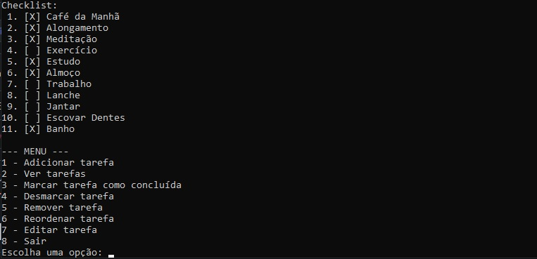

# Checklist de Atividades Diárias

Este é um programa em Python que funciona como uma **checklist de atividades diárias**, permitindo organizar e acompanhar suas tarefas de forma prática.

## Funcionalidades

- Adicionar e remover atividades.  
- Marcar ou desmarcar atividades como concluídas.  
- Alterar a ordem das atividades na lista.  
- Ao final do dia, todas as tarefas são desmarcadas automaticamente, permitindo começar o dia seguinte com a lista limpa.

## Sobre o Projeto

Este foi meu **primeiro programa em Python**, e foi uma ótima experiência de aprendizado.
O projeto começou de forma simples, mas à medida que eu testava e usava a checklist, senti a necessidade de adicionar **novas funcionalidades básicas** para que o programa atendesse realmente ao que eu precisava.  
Cada melhoria implementada foi uma oportunidade de aprender mais sobre lógica de programação e organização de código.

## Como Usar

1. Abra o arquivo `checklist.py` no seu interpretador Python.  
2. Siga as instruções na tela para adicionar, remover ou marcar suas tarefas.  
3. Ao final do dia, todas as tarefas serão automaticamente desmarcadas para começar o próximo dia do zero.

---
